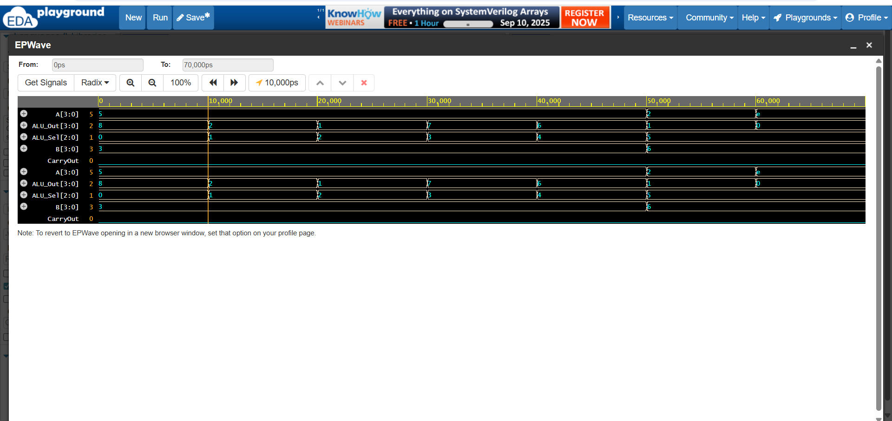

# 🧮 4-bit Arithmetic Logic Unit (ALU)

## 📌 Overview
This project implements a **4-bit Arithmetic Logic Unit (ALU)** in **SystemVerilog**.  
The ALU performs basic arithmetic and logic operations on 4-bit inputs and produces a 4-bit output along with a carry flag.

The design was written in **SystemVerilog (RTL)** and tested with a **SystemVerilog testbench**.  
Simulation and waveform analysis were done using **Icarus Verilog** and **GTKWave/EPWave**.

---

## ⚙️ Features
- 4-bit Inputs: `A`, `B`
- 3-bit ALU Select (`ALU_Sel`)
- 4-bit Output: `ALU_Out`
- Carry Flag: `CarryOut`

### Operations Supported
| ALU_Sel | Operation       | Description                  |
|---------|----------------|------------------------------|
| 000     | ADD            | `A + B`                      |
| 001     | SUB            | `A - B`                      |
| 010     | AND            | Bitwise AND                  |
| 011     | OR             | Bitwise OR                   |
| 100     | XOR            | Bitwise XOR                  |
| 101     | SLT            | Set if A < B (less than)     |

---

## 📂 Repository Structure
4-bit-ALU/
│
├── design.sv # ALU RTL design code
├── testbench.sv # Testbench code
├── alu_wave.vcd # Simulation waveform dump
├── run.sh # Script to compile & run simulation
└── README.md # Project documentation

---

## 🛠️ Tools Used
- **SystemVerilog (IEEE 1800-2012)**
- **Icarus Verilog (iverilog)** for simulation
- **GTKWave / EPWave** for waveform viewing
- **Linux shell script** (`run.sh`) for build automation

---

## 🧪 Simulation Results

### Example Console Output
Time=0 | A=0101 B=0011 Sel=000 | Out=1000 Carry=0 (5+3=8)
Time=10 | A=0101 B=0011 Sel=001 | Out=0010 Carry=0 (5-3=2)
Time=20 | A=0101 B=0011 Sel=010 | Out=0001 Carry=0 (AND)
Time=30 | A=0101 B=0011 Sel=011 | Out=0111 Carry=0 (OR)
Time=40 | A=0101 B=0011 Sel=100 | Out=0110 Carry=0 (XOR)

### Example Waveform
> Waveform generated from `alu_wave.vcd` (open in GTKWave or EPWave).  

  
---
